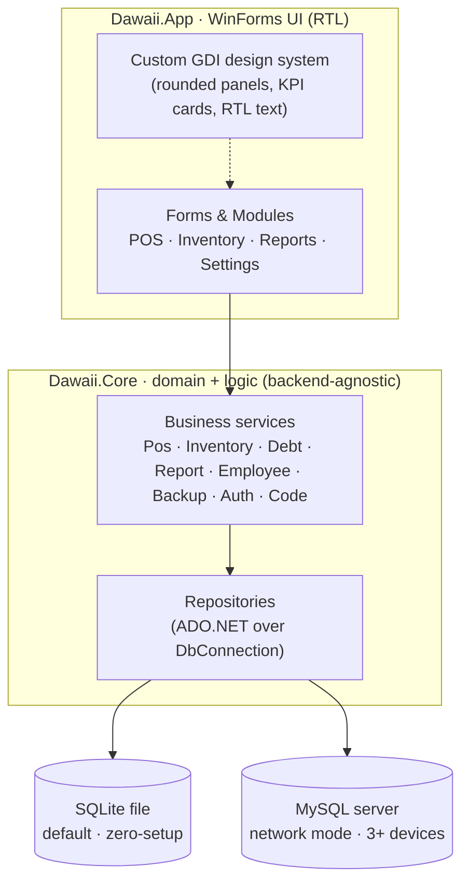
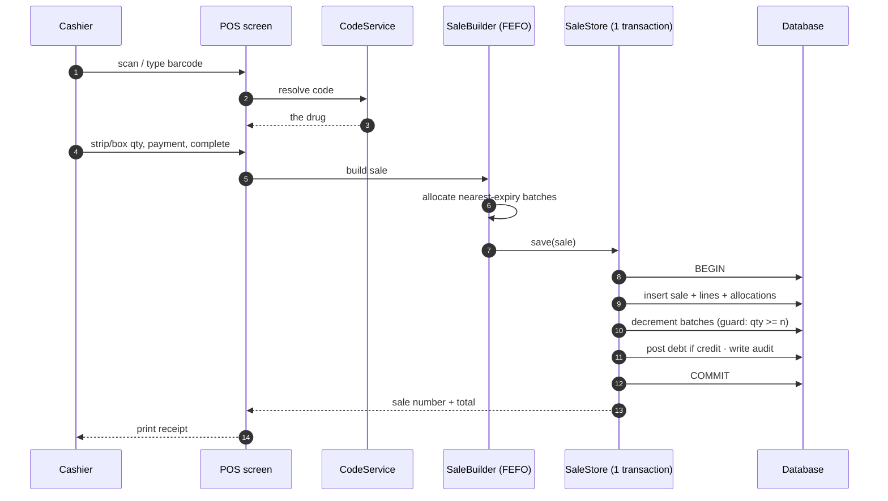

# Dawaii (دوائي) — System Overview

**Pharmacy Management System · Business & Architecture Brief**

An Arabic, right-to-left pharmacy system for independent pharmacies: stock, point-of-sale, customer debt,
staff, and reporting — built to work with **no internet, no server, and no setup**, then scale to several
networked terminals when the shop grows.

| | |
|---|---|
| **Platform** | Windows desktop |
| **Stack** | .NET Framework 4.8 · C# · WinForms |
| **Default DB** | SQLite (embedded, zero-setup) |
| **Network DB** | MySQL (LAN, 3+ devices) |
| **Language** | Arabic RTL · currency SDG |
| **Tests** | 126+ automated (unit + real-DB integration) |

---

## 1. What it is, in one breath

Dawaii replaces the paper ledger and the calculator at a pharmacy counter. Everything a pharmacy owner and
their cashiers do every day — receiving medicine, selling by strip or box, tracking who owes money, watching
expiry dates, and closing the shift — happens in one program that keeps working during a power cut or an
internet outage.

- **🏪 For the owner** — a live view of sales, profit, low stock, near-expiry drugs and outstanding debts, plus
  full control over prices, staff and backups.
- **🧾 For the cashier** — a fast point-of-sale: scan a barcode, pick strip or box, take cash / بنكك / فوري,
  print the receipt. Nothing else to learn.
- **🔌 Offline-first** — runs from a single SQLite file with zero configuration. Add a shared MySQL server only
  when 3+ machines need the same data.

---

## 2. Business architecture

A clean layered solution: one backend-agnostic **core** holds all the rules and data access, one **WinForms**
project holds the Arabic UI. A single composition root wires them together — the same repositories run
unchanged on SQLite or MySQL.

*One data-access layer, two interchangeable backends. Swapping SQLite for MySQL changes a connection string,
not the business logic.*

- **Layer boundaries** — UI → Services → Repositories → Database. The UI never touches SQL; services never draw
  pixels. Business rules live in one place and are unit-tested without a screen or a real database.
- **Composition root** — `AppServices` builds every repository and service once at startup and hands them to
  the forms. Deliberately no DI container, because a single-shop desktop app doesn't need one.
- **Two deployment modes** — *Local:* a self-contained SQLite file per PC. *Network:* the manager's PC runs
  MySQL as a Windows service; other terminals point at it over the LAN.
- **Cross-cutting safety** — PBKDF2 password hashing, a full audit log of every sensitive action, a crash log
  written to disk, and automatic local backups with retention.

---

## 3. Business logic — the rules that make it a pharmacy

These are the domain rules encoded in the core services. They are what separate this from a generic shop till.

| Area | Rule | How it works |
|---|---|---|
| **Units & price** | Priced by box, sold by box or strip | One box = several strips = many units. The owner enters the **box price**; the strip price is derived automatically (box ÷ strips). Loose single units are never sold. |
| **Stock** | FEFO — first to expire, first out | Stock is held as dated batches. A sale always draws from the **nearest-expiry** batch first, so the oldest medicine leaves the shelf before it expires. |
| **Integrity** | One sale, one transaction, no overselling | A sale writes its lines, decrements stock, posts any debt and logs an audit entry inside a **single database transaction**, guarded by `quantity ≥ n`. A power cut can't leave half a sale, and a second terminal can't sell stock that's already gone. |
| **People** | Three roles | **Admin** (مدير) — management: reports, staff, settings, customers, money. **Cashier** (موظف) — selling: POS, returns, own expenses; the catalog is read-only to them. **Privileged employee** (موظف ذو امتيازات) — a cashier the manager trusts with the stockroom and the buying: everything a cashier does, **plus** the catalog and stock (adding / editing / deleting drugs, receiving batches, barcodes, disposals, the قرب الانتهاء watch list), **plus** companies and their orders, **plus** the customer ledger for statements and payments only (they cannot open, edit or delete an account holder). V2.2 briefly moved them off the shelves and onto the buying side alone; V2.3 restored the stockroom, because the person who files an order is the person who unpacks it. The manager sets the role when creating the account and can change it later from إدارة الموظفين. Every stock change is stamped with its author in the audit log. |
| **Money in** | Cash, bank & credit kept apart | A paid sale is tagged كاش / بنكك / فوري; only كاش counts toward the cash expected in the drawer. Credit sales post to a customer **debt ledger** instead. |
| **Time & loss** | Expiry and low-stock drive the alerts | A near-expiry window plus per-item **min / max** levels feed the dashboard warnings. Expired batches are disposed and the loss is recorded. |
| **Buying** | A delivery is an invoice, and the invoice is the payable | Stock is bought from a company on an invoice. Every line becomes its own stock batch, written in the same transaction as the invoice — so what the paperwork says arrived is what the shelf holds, or neither exists. The total is summed from the lines and never typed. What is still owed is `total − paid`, per invoice and summed per company; there is no stored status that could contradict the amounts. |
| **Naming** | A drug has two names, written as one | The trade name on the box (*polymol*) and the scientific name under it (*paracetamol*). Lists, search and pickers write the pair as **polymol / paracetamol**, so the same box is found whichever name the customer or the cashier knows; the receipt prints the trade name alone, because it truncates to the roll's width. Search matches either. |
| **Identity** | A barcode belongs to exactly one drug | Any scanned or typed code resolves to a single item. Scanning **is** searching — the same code finds the drug at the counter, in inventory, and in the expense screen. |
| **Staff** | Attendance and staff cost are automatic | Clock-in is recorded at login. Salaries, leaves and deductions roll up per employee; medicine a staff member takes is valued at its selling price and shown in the shift report. |

---

## 4. What the app does & how — by who uses it

Every screen maps to a real job on the shop floor. Arabic names are the labels the user actually sees.

### 👤 Admin — the owner / manager

| Screen | What it does |
|---|---|
| **Dashboard** — الرئيسية | Today's sales vs. yesterday, near-expiry count, low-stock count, pending debts, and a backup reminder — at a glance. |
| **Items & Inventory** — الأصناف والمخزون | Search & filter the catalog. **"مخزون كامل"** creates a drug and its stock, min/max levels and barcode in one form. Batches carry the batch number, expiry and the BOX purchase/selling prices; strip prices divide down automatically and are read-only. |
| **Staff** — شؤون / إدارة الموظفين | Accounts & roles, salaries, leaves, deductions, and a per-employee performance view. |
| **Reports & Shift** — التقارير · تقرير الوردية | Daily / weekly / monthly totals, expected cash in drawer, double-click an employee to drill into their invoices, export to PDF / Excel / CSV. |
| **Settings & Backup** — الإعدادات والنسخ | Pharmacy details, backup folder & restore, and network-mode configuration. |

### 🧾 Cashier — the person at the counter

| Screen | What it does |
|---|---|
| **Point of sale** — نقطة البيع | Scan or search → item drops into the cart → choose strip or box and quantity → apply a discount → pick the payment method → complete as cash or credit → print. A wrong line comes out with the ✕ on the row (or Del). |
| **Returns** — إرجاع أصناف من فاتورة | Find the invoice by its number, then take back the whole thing or just part of it — 5 of the 50 boxes sold. The returned units go back on the exact batches they were sold from, the customer is refunded their share of the invoice (discount included), any debt is unwound, and the rest of the invoice stays sold. All transactional. |
| **My expenses** — مصروفاتي | Log cash taken or medicine used, finding the drug by name or barcode. It flows straight into the shift report. |
| **Items & Inventory** — الأصناف والمخزون | Search the catalog for a price or a quantity. Read-only for a plain cashier; a **موظف ذو امتيازات** gets the manager's full toolbar here — add / edit / delete drugs, attach barcodes, receive shipments with their box prices and expiry, adjust quantities and dispose expired batches — plus the قرب الانتهاء watch list. |
| **Purchases report** — تقرير المشتريات | Manager only. Every order in a chosen period with the company, the representative, **who placed it and when**, its total and what is still owed — an order commits the pharmacy's money, so it is attributable. Underneath, the outstanding balance per company across **all** invoices, ignoring the period: reporting a debt only because it fell inside the chosen month would understate what is actually owed. Any order prints on A4 from here or from the company's screen. |
| **Suppliers & buying** — الموردون والمشتريات | The companies the pharmacy buys from — the mirror of العملاء والديون, listing who the pharmacy owes rather than who owes it. A row opens the company: every delivery it made, what each invoice still owes, and the running total. A new invoice picks or creates each drug through the same picker the stock screens use, so an existing medicine gains a batch while its own details are left alone. Saving goes straight on to the payment screen — paid in full, part paid, or unpaid — and that screen reopens from the invoice list for every later instalment. Manager and **موظف ذو امتيازات**; deleting a company is the manager's. |
| **Customers & debts** — العملاء والديون | Only a **موظف ذو امتيازات** sees this screen: search the ledger, filter to أصحاب الديون فقط, open a customer's كشف حساب — every debt and payment with its running balance and the invoice behind each line — and record the payment they came in to make. Opening, editing or deleting a customer stays with the manager. |
| **Printing** | The cashier's receipt prints on the 80 mm roll; the same sale prints as a full A4 invoice for the admin — automatically, to the default printer. |

### How one sale actually executes

---

## 5. Data model at a glance

22 tables, grouped by the part of the business they serve. The same schema is generated for both SQLite and
MySQL, and migrated forward automatically for older installs.

| Group | Tables |
|---|---|
| **Catalog & stock** | `items`, `categories`, `item_codes`, `stock_batches`, `stock_adjustments`, `price_history` |
| **Sales** | `sales`, `sale_lines`, `sale_line_allocations`, `returns`, `return_lines` |
| **Customers & debt** | `customers`, `debt_transactions` |
| **People & payroll** | `users`, `attendance`, `employee_profiles`, `leaves`, `deductions`, `employee_expenses` |
| **System** | `settings`, `audit_log`, `backups` |

---

## 6. Build & quality

- **Engineering** — .NET Framework 4.8 · C# · WinForms · `System.Data.SQLite` · `MySql.Data` · NPOI (Excel) ·
  PdfSharp (PDF) · QRCoder.
- **Correctness** — 126+ automated tests, including real-database integration tests that prove the
  transactional sale, FEFO math, box-price round-trips and barcode flows.
- **Trust** — PBKDF2-hashed passwords, a complete audit trail, on-disk crash logging, and automatic local
  backups with restore.

---

Dawaii (دوائي) · made by **JK software** · developed by **Ahmed Jamal** · **+249 911 757 214**
